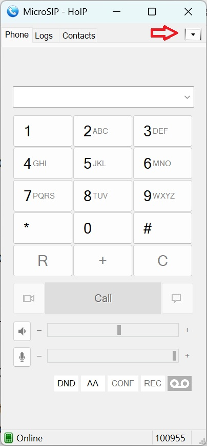
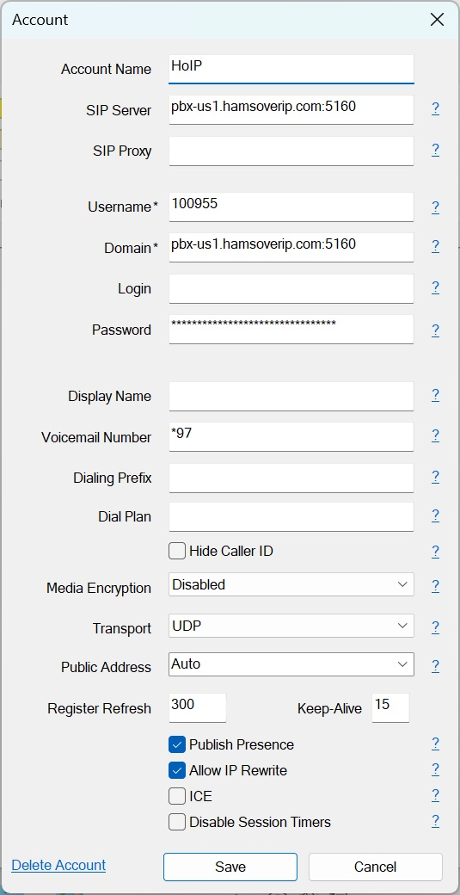
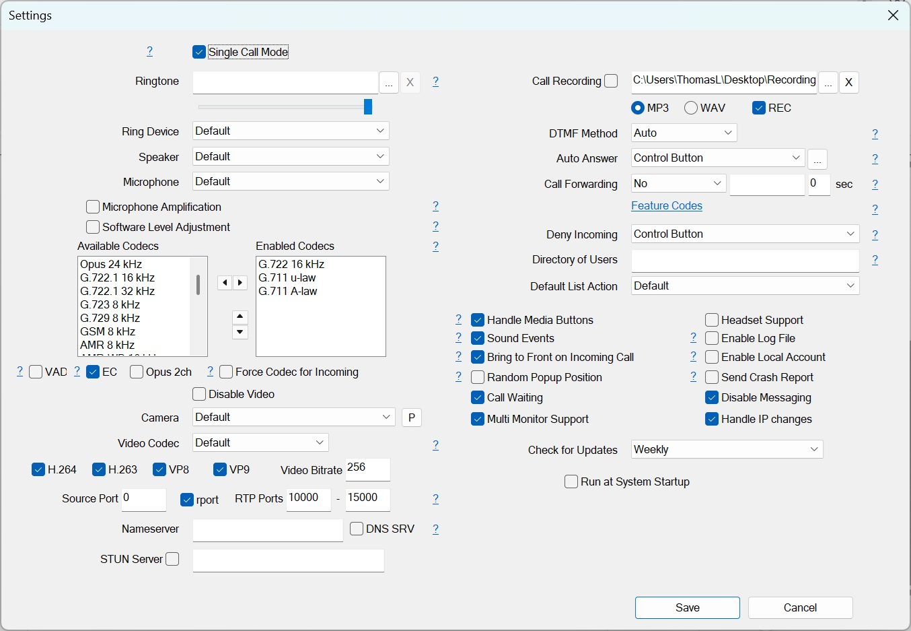

# Configuring MicroSIP for Windows on HoIP

## Instructions

1. Download and install from \[MicroSIP website](https://www.MicroSIP.org/) (free)

2. Click the drop-down menu in the top-right corner and click on "Add Account"

   1. { height="50%" width="50%" }
   2. The important fields are listed below:
      1. { height="50%" width="50%" }
      2. **Account Name**: Whatever you choose, such as "HoIP"
      3. **SIP Server** & **Domain**: The domain and port number of the server sent to you in the credentials email you received. If copying and pasting from the email, delete the http:// prefix and the / suffix after pasting
      4. **Username**: Extension from your credentials email. If **Login** is left blank as shown, it uses the **Username**
      5. **Password**: Password from your credentials email
      6. **Voicemail Number**: Entering \*97 will enable the voicemail button below the dialer for convenience
      7. **Transport**: Should be left UDP

3. From the drop-down menu in #2 above, click on "Settings". Fields that are noteworthy are listed below:

   1. { height="50%" width="50%" }

     1. **Single Call Mode**: If not checked, it shows an "AC" button used for automatic conferencing on incoming calls and when a call comes in, another window shows up on how to handle the call
     2. **Enabled Codecs**: Shown with the best, supported codecs
     3. **Disable Messaging**: Should check this to prevent accidentally sending SMS-style messages which will not work properly, it will ring the calling number with an anonymous caller

!!! note "Last updated 2025-09-27 Thomas KF7ZTM"
