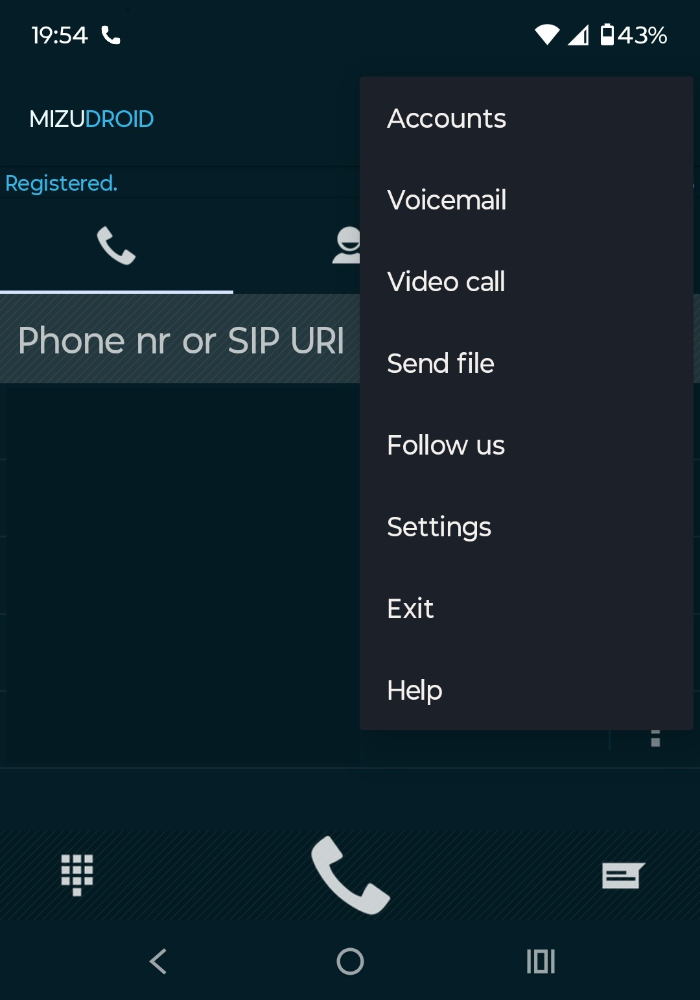
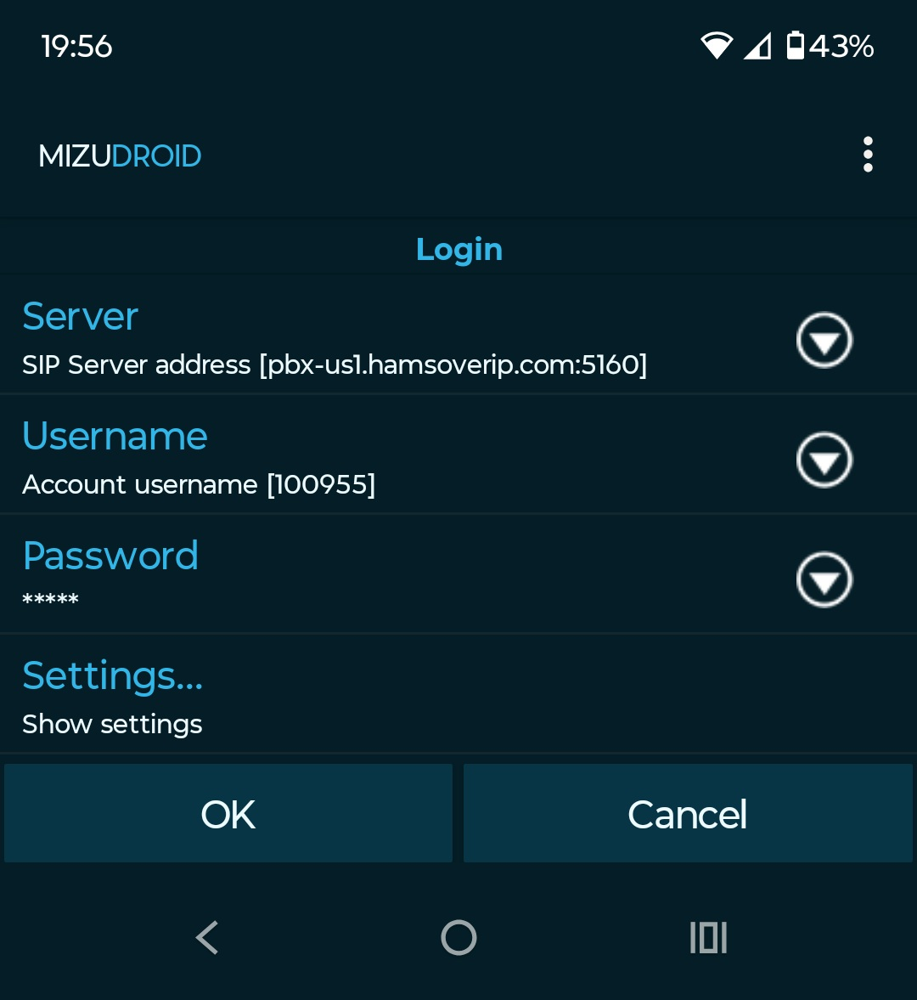

# Configuring MizuDroid for Android on HoIP

## Instructions

1. Install from Google Play Store (free)

2. Tap the three dots in the top-right corner and tap on "Settings"

   1. { height="50%" width="50%" }
   2. The important fields are listed below:
      1. { height="50%" width="50%" }
      2. **SIP Server**: The domain and port number of the server sent to you in the credentials email you received. If copying and pasting from the email, delete the http:// prefix and the / suffix after pasting
      4. **Username**: Extension from your credentials email
      5. **Password**: Password from your credentials email
      6. **Settings...**: Make sure the **Transport protocol** is set to UDP

!!! note "Last updated 2025-09-27 Thomas KF7ZTM"
